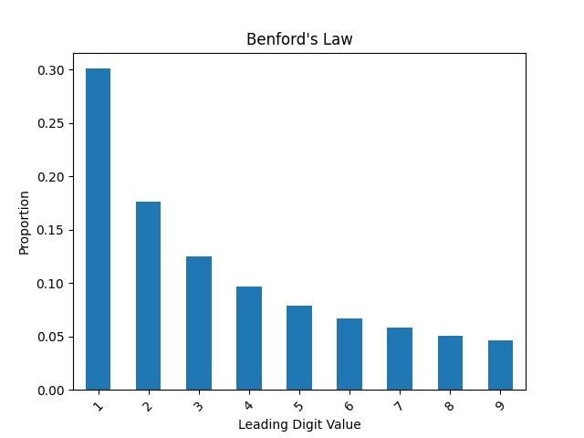

# Benford's Law with Pandas

## About

### Summary

This project was created as an exercise to learning the pandas library. It's a Python script that plots a 1st digit/2nd digit Benford's law test and Last Digits test on 2020 US Election voter data.

Benford's law is used reputably in accounting, auditing, and finance as a quick, simple way to screen for potential fraud. Its use in election fraud has been widely studied but its veracity in its ability to do so and overall applicability to election data is largely debated. This field of study is known as "election forensics."

The methods used in this repo were inspired by Beber & Scacco's "What the Numbers Say: A Digit-Based Test for Election Fraud" (2012) and the Association of Certified Fraud Examiners's (ACFE) instructive document "Using Benford's Law to Detect Fraud" (2018).

The Python script's plotting of Benford's law and Last Digits test on 2020 voter data saw in a few states deviations that indicate potential anomalies (fraud) affecting both parties. Overall though, this naive and very on the surface application and interpretation of the results either indicates that there is potential fraud in some areas or indicates nothing at all.

### Background

Benford's law states that the distribution of leading digits of numbers in naturally occurring datasets is not uniform as might be expected, but rather number 1 occurs most often and following numbers occur less and less often. Once calculated, it is found that the distribution of leading digits is as follows:

| Number (1st Digit)    | 1     | 2     | 3     | 4    | 5    | 6    | 7    | 8    | 9    |
|-----------------------|-------|-------|-------|------|------|------|------|------|------|
| Percentage            | 30.1% | 17.6% | 12.5% | 9.7% | 7.9% | 6.7% | 5.8% | 5.1% | 4.6% |



This can be expressed as the formula:


Building on this, the expected distribution of the second leading digit can be found:

| Number (2nd Digit)    | 0     | 1     | 2     | 3     | 4     | 5    | 6    | 7    | 8    | 9    |
|-----------------------|-------|-------|-------|-------|-------|------|------|------|------|------|
| Percentage            | 12.0% | 11.4% | 10.9% | 10.4% | 10.0% | 9.7% | 9.3% | 9.0% | 8.8% | 8.5% |

As you calculate Benford's law for further digits, it very quickly approaches a uniform distribution in which the frequencies of each digit is expected to be 10%.

Similarly, for datasets with decently large numbers the expected distribution of the final digits of the numbers should be uniform i.e. the Last Digits test.

Benford's law holds true overwhelmingly in naturally occurring datasets. [This blog](https://www.r-bloggers.com/2020/08/benfords-law-applying-to-existing-data/) tested Benford's law on various datasets including the US census, an image of a pizza, and music and found nearly perfect conformity to Benford's law on all tests.

Using this knowledge, Benford's law can be used to find anomalies in data that may reflect outside interference or tampering of the data. A typical person may not aware of this law nor humans' natural incapability to generate true random numbers or may try to generate a uniform distribution where Benford's law should apply, so when tampering with otherwise "naturally" occurring data and trying to pass it off as authentic anomalies are created that are uncovered by tests like the Benford's law test or Last Digits test.

### Datasets

Election data for all states and counties within was obtained on 11/11/2020 from https://www.realclearpolitics.com/elections/live_results/2020/counties_president.json

More in depth election data within Georgia and Pennsylvania was obtained respectively from https://results.enr.clarityelections.com/GA/105369/web.264614/#/summary and https://www.electionreturns.pa.gov/ReportCenter/Reports

## A look at the Results

Jpgs for all plots are available in the other directories.

### Benford's Law

Testing Benford's law on the candidate vote counts of all counties nationwide shows conformity to Benford's law for all parties:


Testing the second digit also conforms:


At the state level though, noting that the sample size is much smaller, it becomes more interesting:

First, Texas:


Texas vote counts for all parties follow Bendford's law's expected distribution nicely.

Now Pennsylvania, an important swing state -


Trump's data follows the distribution and Biden's does not. Someone can easily cherry pick these images and claim "evidence of Biden's election fraud in Pennsylvania."

Looking at Iowa, which Trump won with a large margin -


This time Biden's data follows the distribution and Trump's does not. Again, someone can easily cherry pick these images and this time claim "evidence of Trump's election fraud in Iowa."

Now California, which Biden won with a large margin and has voted one sidedly democrat for decades -


Here both parties seemingly have anomalies.

So, breaks from the expected distribution of Benford's law is seen on both sides, which may or may not mean something.

However, this is Benford's law applied to the first leading digit; typically when using Benford's law on election data the second leading is used to eliminate inaccuracies due to significant variations in population sizes. For example, if a state consisted only of counties with populations between 50,000 and 60,000 then naturally Benford's law for the first digit would not be followed.

Therefore, testing the leading digit is probably not sufficient and would reflect moreso population and voter turnout sizes than anything else.

But overall, most county vote counts do conform to Benford's law well which is viewable in the other directories.

Now testing Benford's law for the second digit:

Looking at Pennsylvania again -


The plots of the second digit are noisy and probably reflect small sample sizes more than anything else.

Plots for all states are viewable in the other directories.

#### Other interesting plots

Votes in Georgia for senators all follow Benford's law's leading digit distribution nicely including those with few votes:

%20-%20David%20A.%20Perdue%20(I)%20(Rep)%20(By%20County)%20Vote%20Count%20-%202%2C457%2C980%2C%20Size%20-%20592.jpg)
%20-%20Jon%20Ossoff%20(Dem)%20(By%20County)%20Vote%20Count%20-%202%2C369%2C974%2C%20Size%20-%20581.jpg)
%20-%20Shane%20Hazel%20(Lib)%20(By%20County)%20Vote%20Count%20-%20114%2C807%2C%20Size%20-%20518.jpg)
%20-%20Special%20-%20Raphael%20Warnock%20(Dem)%20(By%20County)%20Vote%20Count%20-%201%2C613%2C995%2C%20Size%20-%20558.jpg)
%20-%20Special%20-%20Kelly%20Loeffler%20(I)%20(Rep)%20(By%20County)%20Vote%20Count%20-%201%2C270%2C786%2C%20Size%20-%20575.jpg)
%20-%20Special%20-%20Michael%20Todd%20Greene%20(Ind)%20(By%20County)%20Vote%20Count%20-%2013%2C255%2C%20Size%20-%20478.jpg)
%20-%20Special%20-%20Annette%20Davis%20Jackson%20(Rep)%20(By%20County)%20Vote%20Count%20-%2044%2C235%2C%20Size%20-%20511.jpg)

(Among others)

Votes in Georgia for Constitutional Amendment #1 and #2 also follow Benford's law's leading digit distribution nicely:

%20Vote%20Count%20-%20867%2C772%2C%20Size%20-%20573.jpg)
%20Vote%20Count%20-%203%2C855%2C468%2C%20Size%20-%20594.jpg)
%20Vote%20Count%20-%201%2C195%2C473%2C%20Size%20-%20577.jpg)
%20Vote%20Count%20-%203%2C484%2C783%2C%20Size%20-%20593.jpg)

Here is a look at Pennsylvania's mail ballots:

1st Digit distribution -

%20-%20JORGENSEN%20Vote%20Count%20-%2024%2C317%2C%20Size%20-%2067.jpg)
%20-%20TRUMP%20Vote%20Count%20-%20586%2C481%2C%20Size%20-%2067.jpg)
%20-%20BIDEN%20Vote%20Count%20-%201%2C959%2C220%2C%20Size%20-%2067.jpg)

2nd Digit distribution -

%20-%20JORGENSEN%20Vote%20Count%20-%2024%2C308%2C%20Size%20-%2066.jpg)
%20-%20TRUMP%20Vote%20Count%20-%20586%2C481%2C%20Size%20-%2067.jpg)
%20-%20BIDEN%20Vote%20Count%20-%201%2C959%2C220%2C%20Size%20-%2067.jpg)

### Last Digits test

Testing the last two digits for a uniform distribution on the candidate vote counts in all counties nationwide:


Jorgensen interestingly shows a non-uniform distribution in the 2nd last digit. Other candidates show uniform distribution of the last two digits.

Plotting this at the state level didn't seem sufficient due to small sample sizes but are still viewable in the other directories.

### Conclusion

Benford's law and the Last Digits test are used commonly in accounting, auditing, and finance to screen for fraud. Significant deviations from the expected distribution of Benford's law or a non-uniform distribution of the Last Digits may indicate tampering or fraud. However, its use in elections is largely disputed.

In this project, with large sample sizes, specifically when aggregating all vote counts of all 4,577 counties that reported data in the US, both Benford's law and the Last Digits test all held true. It's only when going down a level into individual states when it got interesting and data started to deviate which may or may not indicate tampering or fraud.

This was my first time writing code that revolved entirely around pandas and I'm very pleased with how powerful and easy it is to use. I'm looking forward to using pandas more in the future.

## How to use

### Pre-requisites

```
python 3.8.5, pandas 1.1.4, matplotlib 3.3.2
```

### Files

All Python scripts have parameters as globals at the top of the script. See comments for more info.

```
/
    main.py                     - Generate plots using nationwide data.
    Georgia-Election/
        main.py                 - Generate plots with Georgia's dataset
        Presidential-Plots/     - Plot jpgs for presidential plots
    Pennsylvania-Election/
        main.py                 - Generate plots with Pennsylvania's dataset
        Non-presidential-Plots/ - Plot jpgs for presidential plots
        Presidential-Plots/     - Plot jpgs for presidential plots
    1st-Digit-BL-Test/          - Plot jpgs for 1st digit BL test
    2nd-Digit-BL-Test/          - Plot jpgs for 2nd digit BL test
    Final-Digits-Test/          - Plot jpgs for Last Digits test

```
